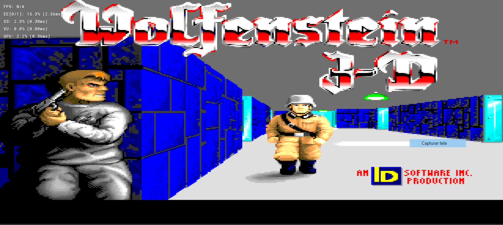

# Wolf4SDL For PlayStation 2



This is a homebrew port Wolfenstein and Spear Of Destiny for Playstation 2

This port uses the unofficial [PS2DEV SDK](https://github.com/ps2dev/ps2dev) and [SDL2](https://github.com/libsdl-org/SDL) to provide rendering,
input, audio and system functionalities for the Wolfenstein engine(Aka: id Tech 0)

## How to run
Pick the Wolf4SDL executable compatible with the game version,
unzip it then go to pcsx2 and execute the elf file or in real hardware transfer the folder unzipped to your pen-drive,
run wLaunchELF and find the game on `mass0:` or `mc0:` if you transfer it, then hit the .ELF file and done.

Note: 
hdd and mc support is not tested(mc support should be work fine by the way, but don´t hesitate to contact me). 

```

## Controls:
R2/L2: Shoot \
Triangle: Previous weapon \
Circle: Next weapon \
Cross: Open \
Left Stick: Move
Right Stick: Look

# Bugs
* Performance issues

## License

Wolf4SDL was released as ID License, and it remains as such. New code written
for the PS2 port or any changes made to the original source code are also released under the
ID SOFTWARE LICENSE. See the accompanying [license-id.txt](license-id.txt) for details.

## Credits

* id Software for releasing the Wolfenstein engine
* [Moritz "Ripper" Kroll](@Grimmick) for Creating the Wolf4SDL
* [AlumiuN](@AlumiuN) For maintaining the Wolf4SDL
* [KS-Presto](https://bitbucket.org/ks-presto/) for the awesome contribution to the Wolf4SDL